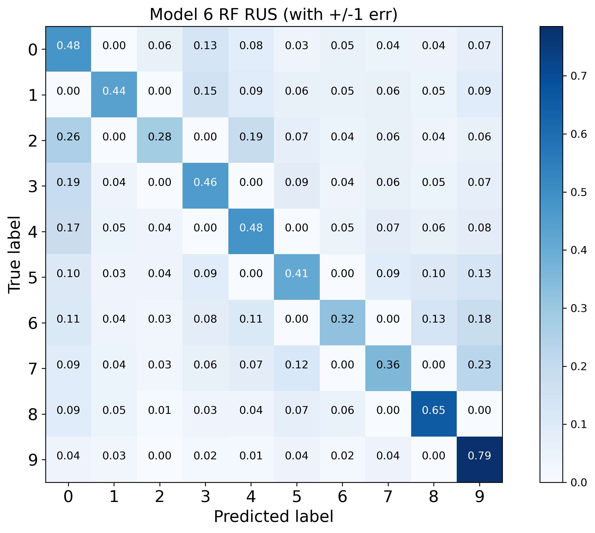

# Confusion Matrix of RF Models with Random Undersampling (RUS)

## Model 1: RF RUS with 10 bands (45 features)
 

## Model 2: RF RUS with `ugriz` bands (10 features)
 

## Model 3: RF RUS with `rijhkW1W2` bands (21 features)
 

## Model 4: RF RUS with `rijhk` bands (10 features)
 

## Model 5: RF RUS with `jhkW1W2` bands (10 features)
 

## Model 6: RF RUS with `jhk` bands (3 features)
 
